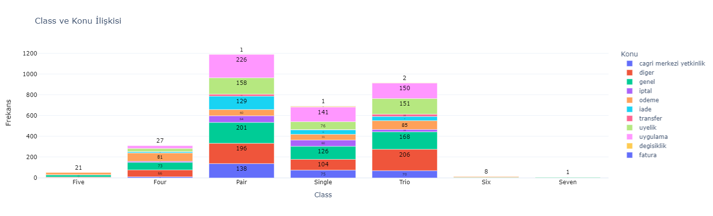
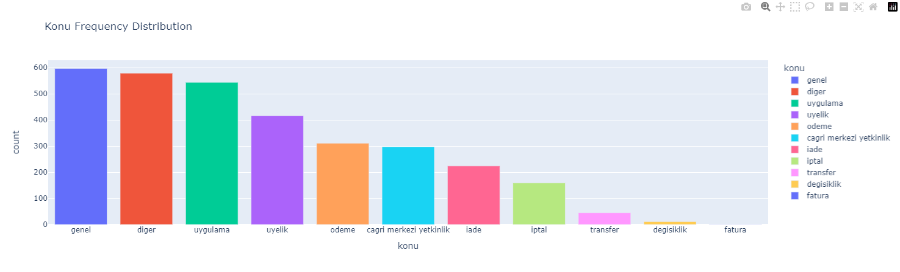
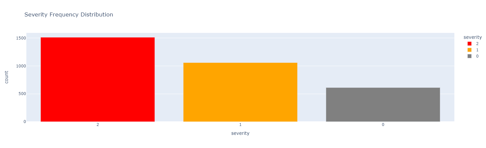

# PassoAssist

**English version is below!**

**Geliştirici**: [Ali Rıza Ercan](https://www.linkedin.com/in/alirizaercann/)

## Türkçe [TR]

### Proje Açıklaması

**PassoAssist**: Bu proje, şikayet yönetimi ve çözümü için akıllı bir sistem geliştirmeyi hedefler. Proje, veri bilimi ve doğal dil işleme (NLP) tekniklerini kullanarak kullanıcı geri bildirimlerini analiz eder ve anlamlı sonuçlar üretir. Sistem, web scraping yöntemleriyle veri toplar, verileri işleyip analiz eder ve sonuçları kullanıcı dostu bir arayüzde sunar.

### Veri Bilimi Açısından Önemi

**PassoAssist**, veri bilimi açısından büyük bir önem taşır çünkü:

1. **Veri Toplama ve Ön İşleme**: Web scraping yöntemleri ile toplanan büyük veri kümesi üzerinde veri ön işleme adımları uygulanır. Bu süreç, verinin kalitesini artırarak doğru analizler yapılmasını sağlar.
2. **Sentiment Analizi**: Doğal dil işleme teknikleri kullanılarak metinlerin sentiment analizi yapılır. Bu analiz, şikayetlerin duygusal tonunu anlamak ve kullanıcılara uygun çözümler sunmak için önemlidir.
3. **Kategorilendirme**: Şikayetlerin türlerine göre kategorilere ayrılması, veri yönetimini ve çözüm önerilerini daha etkili hale getirir.
4. **Gerçek Zamanlı Analiz**: Web arayüzü üzerinden kullanıcıların veri talep edebilmesi ve sonuçları anlık olarak görmesi sağlanır. Bu, kullanıcılara hızlı geri dönüşler sunar ve veri bilimi uygulamalarının etkinliğini artırır.

### Proje Hakkında
PassoAssist, Passo web sitesi için geliştirilmiş bir chatbot'tur. Bu chatbot, sitenin sağ alt kısmında yer alarak kullanıcıların sorunlarına öneriler sunmaktadır. Aşağıda PassoAssist'in çalışan görüntüsüne yer verilmiştir.


### Veri Kaynağı
PassoAssist projesinde veriler, [Şikayetvar](https://www.sikayetvar.com/) adlı siteden hem Passo hem de Passolig için Python'da Selenium ve BeautifulSoup kütüphaneleri kullanılarak çekilmiştir.

- Passo verileri, `scripts/scraping_passo.py` dosyası ile çekilip `data/raw/raw_data_passo.csv` dosyasına aktarılmıştır.
- Passolig verileri, `scripts/scraping_passolig.py` dosyası ile çekilip `data/raw/raw_data_passolig.csv` dosyasına aktarılmıştır.
- Hem Passo hem de Passolig verileri, `scripts/scraping.py` dosyası ile birleştirilip `data/raw/raw_data.csv` dosyasına aktarılmıştır.

Kullanıcılar veri çekmek için aşağıdaki komutları girebilirler:

```bash
cd scripts
python scraping_passo.py
python scraping_passolig.py
python scraping.py
```
### Veri Ön İşleme
Veri çekiminden sonra, gelen metin verileri `scripts/model_training_scripts/text_cleaning.py` dosyası ile ön işleme tabi tutulmuştur. Metin temizleme süreci için aşağıdaki komutlar kullanılabilir:

```bash
cd scripts
cd model_training_scripts
python text_cleaning.py
```

Veri ön işleme adımının tamamlanmasının ardından, ilgili sütunlar manuel olarak etiketlenmiştir. Bu, eğitim veri setinin yüksek doğrulukla oluşturulması amacıyla yapılmıştır. Manuel etiketlenen veri seti, `merged_df` olarak kaydedilmiş ve `data/processed/merged_df.csv` dosyasına aktarılmıştır.

### Keşifçi Veri Analizi
Manuel veri etiketlendikten sonra, verileri kontrol etmek için `notebooks/EDA/eda_notebook.ipynb` dosyasında keşifçi veri analizi yapılmış ve görselleştirmeler oluşturulmuştur. Aşağıda görselleştirmelere ait örnekler verilmiştir:





### Model Eğitimi
EDA notebook'tan sonra, `notebooks/model_sentiment_training.ipynb` dosyasında, Hugging Face'ten alınan BERT tabanlı Türkçe modeli olan `saribasmetehan/bert-base-turkish-sentiment-analysis` ile sentiment modeli eğitilmiştir.

Model kodları, `scripts/model_training_scripts` klasöründe yer almaktadır ve detayları aşağıda verilmiştir:

- **Model Entity Training:** `tr_core_news_trf modeli` ile eğitilmiş ve entity tahminleri yapılmıştır. Model `data/models/entity_model.joblib` olarak kaydedilmiştir.

- **Model Konu Training:** SVC modelinde 'konu' sütunu etiketlenmiş ve eğitim verilmiştir. Model `data/models/konu_model.joblib` olarak kaydedilmiştir. Doğruluk skoru: **`0.67`**.

- **Model Multi-Label Classifier:** Binary olarak kodlanan sütunlar ile tahmin yapmak için Random Forest modeli kullanılmıştır. Model `data/models/multilabel/multilabelclassifier.joblib` olarak kaydedilmiştir. Doğruluk skoru: **`0.50`**, F1 skoru: **`0.83`**.

- **Model Sentiment Training:** BERT tabanlı model ile eğitim yapılmış ve olumlu, olumsuz, nötr etiketleri oluşturulmuştur. Model `data/models/sentiment/saribasmetehan_sentiment_model` olarak kaydedilmiştir. Loss skoru: **`0.16`**.

- **Model Severity Training:** Random Forest modeli kullanılarak 'severity' ve 'aksiyon' sütunları doldurulmuştur. Model `data/models/severity_classifier.joblib` olarak kaydedilmiştir.

Model kodları, `scripts/model_training_scripts/all_models.py` dosyasında birleştirilmiştir. Cevap oluşturma kodu ise `scripts/model_training_scripts/response_with_all_models.py` dosyasında yer almıştır.

### Web Arayüzü
Tüm modellerin eğitilmesinin ardından, Flask ile HTML ve CSS kullanarak web arayüzü oluşturulmuştur. İlk olarak, `scripts/model_training_scripts/templates/passo.html` dosyası oluşturulmuş, ardından gerekli fonksiyonlar `response_with_all_models.py` dosyasından çağrılmıştır. Web arayüzünde chatbot başarılı bir şekilde test edilmiştir.

### API ve NLP
Tüm bu adımlardan sonra, `src/api/routes.py` dosyasında `scrape`, `clean_data`, ve `analyze_sentiment` fonksiyonları Flask koduna entegre edilmiştir. `src/nlp` klasöründe ise aşağıdaki kod dosyaları bulunmaktadır:

- `preprocess.py`: Veri ön işleme.
- `text_cleaning.py`: Metin temizleme.
- `train_model.py`: Modellerin eğitimi.
- `predict.py`: Tahmin yapma.
- `response_generator.py`: Cevap oluşturma

`src/app.py` dosyası, Flask kodunu içerir ve gerekli fonksiyonları import eder. Web arayüzü için gerekli dosyalar `web` klasöründe yer almaktadır.

### Testler
Tests klasöründe bazı kodlar için birim testleri gerçekleştirilmiştir:

- `test_nlp.py` ve `test_nlp_unittest.py`: NLP kodu için birim test.
`test_preprocessing.py` ve - `test_preprocessing_unittest.py`: Ön işleme kodu için birim test.
- `test_scraping.py` ve `test_scraping_unittest.py`: Scraping kodu için birim test.

### Katkıda Bulunma ve İletişim

Passo Assist uygulaması lokal olarak çalışıyor olmalıdır. PassoAssist chatbot, sitenin sağ alt kısmında yer alıyor olacak. Oradan chatbot'a veri gönderebilir ve eğitilen modellere göre chatbotun cevap verebildiğini görebilirsiniz. Kod, iyileştirmelere açık bir yapıdadır. Eğer herhangi bir sorun görürseniz, LinkedIn üzerinden iletişime geçebilirsiniz veya Issues kısmında sorunu belirtebilirsiniz. Proje açık kaynak bir projedir ve katkıda bulunabilirsiniz.

# PassoAssist [EN]

## English [EN]

**Developer**: [Ali Rıza Ercan](https://www.linkedin.com/in/alirizaercann/)

### Project Description

**PassoAssist**: This project aims to develop an intelligent system for complaint management and resolution. Using data science and natural language processing (NLP) techniques, the system analyzes user feedback and generates meaningful results. The system collects data through web scraping methods, processes and analyzes the data, and presents the results through a user-friendly interface.

### Importance from a Data Science Perspective

**PassoAssist** is significant from a data science perspective because:

1. **Data Collection and Preprocessing**: Large datasets collected through web scraping are preprocessed to enhance data quality, enabling accurate analyses.
2. **Sentiment Analysis**: NLP techniques are used to perform sentiment analysis on texts. This analysis is crucial for understanding the emotional tone of complaints and providing appropriate solutions.
3. **Categorization**: Categorizing complaints by their types makes data management and solution proposals more effective.
4. **Real-Time Analysis**: Users can request data and view results in real-time through the web interface. This provides quick feedback and enhances the effectiveness of data science applications.

### Project Overview
PassoAssist is a chatbot developed for the Passo website. This chatbot is located in the lower right corner of the site and provides suggestions to users for their issues. Below is a screenshot of PassoAssist in action.


### Data Source
In the PassoAssist project, data is scraped from the Şikayetvar website for both Passo and Passolig using Python's Selenium and BeautifulSoup libraries.

- Passo data is fetched using the `scripts/scraping_passo.py` file and saved to `data/raw/raw_data_passo.csv`.
- Passolig data is fetched using the `scripts/scraping_passolig.py` file and saved to `data/raw/raw_data_passolig.csv`.
- Both Passo and Passolig data are combined using the `scripts/scraping.py` file and saved to `data/raw/raw_data.csv`.

Users can run the following commands to scrape data:
```bash
cd scripts
python scraping_passo.py
python scraping_passolig.py
python scraping.py
```

### Data Preprocessing
After data collection, the incoming text data is preprocessed using the `scripts/model_training_scripts/text_cleaning.py` file. The text cleaning process can be executed with the following commands:

```bash
cd scripts
cd model_training_scripts
python text_cleaning.py
```

Once the data preprocessing step is completed, the relevant columns are manually labeled. This manual labeling is performed to create a training dataset with high accuracy. The manually labeled dataset is saved as `merged_df` and stored in `data/processed/merged_df.csv`.

### Exploratory Data Analysis
After manual data labeling, exploratory data analysis is conducted in the `notebooks/EDA/eda_notebook.ipynb` file to inspect and visualize the data. Below are examples of the visualizations:


### Model Training
Following the EDA notebook, the sentiment model is trained in the `notebooks/model_sentiment_training.ipynb` file using the BERT-based model for Turkish, `saribasmetehan/bert-base-turkish-sentiment-analysis`, obtained from Hugging Face.

Model codes are located in the `scripts/model_training_scripts` directory, with details outlined below:

- **Model Entity Training:** Trained with the `tr_core_news_trf` model to predict entities. The model is saved as `data/models/entity_model.joblib`.

- **Model Topic Training:** The 'topic' column is labeled, and the SVC model is trained on the dataset. The model is saved as `data/models/konu_model.joblib`, achieving an accuracy score of **`0.67`**.

- **Model Multi-Label Classifier:** Uses a Random Forest model to predict binary columns: ['ticket', 'customer_service', 'payment', 'application', 'passolig', 'passolig card', 'other']. The model is saved as `data/models/multilabel/multilabelclassifier.joblib`, with an accuracy score of **`0.50`** and an F1 score of **`0.83`**.

- **Model Sentiment Training:** The sentiment model is trained using the BERT-based model from Hugging Face, labeling it as positive, negative, or neutral. The model is saved as `data/models/sentiment/saribasmetehan_sentiment_model`, with a loss score of **`0.16`**.

- **Model Severity Training:** A Random Forest model is used to fill the 'severity' and 'action' columns based on the text data. The model is saved as `data/models/severity_classifier.joblib`.

After creating and training the model codes, they are combined in `scripts/model_training_scripts/all_models.py`. The response generation code is located in `scripts/model_training_scripts/response_with_all_models.py`.

### Web Interface
After training and saving all models, a web interface is created using Flask, HTML, and CSS. First, the `scripts/model_training_scripts/templates/passo.html` file is created, and then the necessary functions from `response_with_all_models.py` are called. The chatbot is successfully tested on the web interface.

### API and NLP
After these steps, the `src/api/routes.py` file integrates the `scrape`, `clean_data`, and `analyze_sentiment` functions into the Flask code. The `src/nlp` directory contains the following code files:

- `preprocess.py`: Data preprocessing.
- `text_cleaning.py`: Text cleaning.
- `train_model.py`: Model training.
- `predict.py`: Making predictions.
- `response_generator.py`: Generating responses.
The `src/app.py` file contains the Flask code and imports necessary functions from `response_generator.py` and `text_cleaning.py`. Web-related clean code is sourced from the `web` directory, which contains CSS, images, and the `style.css` file in the `static` folder, along with the `chatbot.js` file for chatbot functionality. The templates folder includes the `index.html` file.

### Testing
Unit tests have been conducted for certain codes within the tests directory:

- `test_nlp.py` and `test_nlp_unittest.py`: Unit tests for NLP code.
- `test_preprocessing.py` and `test_preprocessing_unittest.py`: Unit tests for preprocessing code.
- `test_scraping.py` and `test_scraping_unittest.py`: Unit tests for scraping code.

### Contribution and Communication
The Passo Assist application should be running locally. The PassoAssist chatbot will be located at the bottom right corner of the site. You can send data to the chatbot from there and see that it can respond based on the trained models. The code is open to improvements. If you encounter any issues, you can reach out via LinkedIn or specify the issue in the Issues section. The project is open source, and you can contribute.